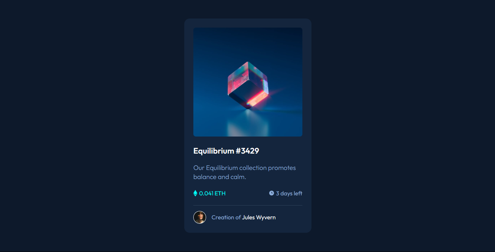
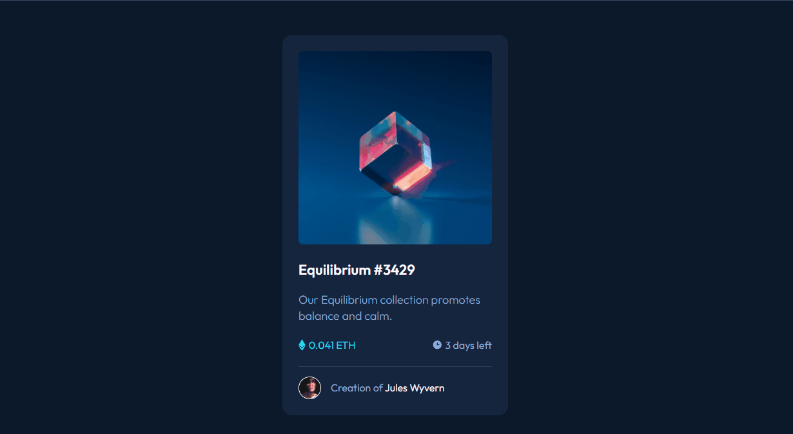

# Frontend Mentor - NFT preview card component solution

Está é uma solução para o desafio [NFT preview card component challenge on Frontend Mentor](https://www.frontendmentor.io/challenges/nft-preview-card-component-SbdUL_w0U). Os desafios do Frontend Mentor ajudam você a melhorar suas habilidades de codificação criando projetos realistas.

> Esse desafio em questão foi feito em conjunto com os gêmeos do canal Dev em Dobro, em uma Workshop do Curso Dev Quest, onde foi abordado como iniciar um projeto sem travar. passando pelo planejamento, análise do projeto, criação de estruturas e etc. 🧙‍♂️🧙‍♂️

## Fotos e Gifs do projeto 📷

[Acesse o Deployment do projeto clicando aqui](https://your-solution-url.com)

## Tecnologias Utilizadas 🛠️

## HTML 
Foi utilizado uma estrutura simples com classes para facilitar a estilização no CSS.  

## CSS 
Foi usado variáveis para estilizar as cores principais do site, o arquivo reset.css para resetar os estilos padrão do navegador, pseudo-elementos como ::after e ::before, também foi usado flex-box no css para centralizar os elementos além de várias outras estilizações simples.
